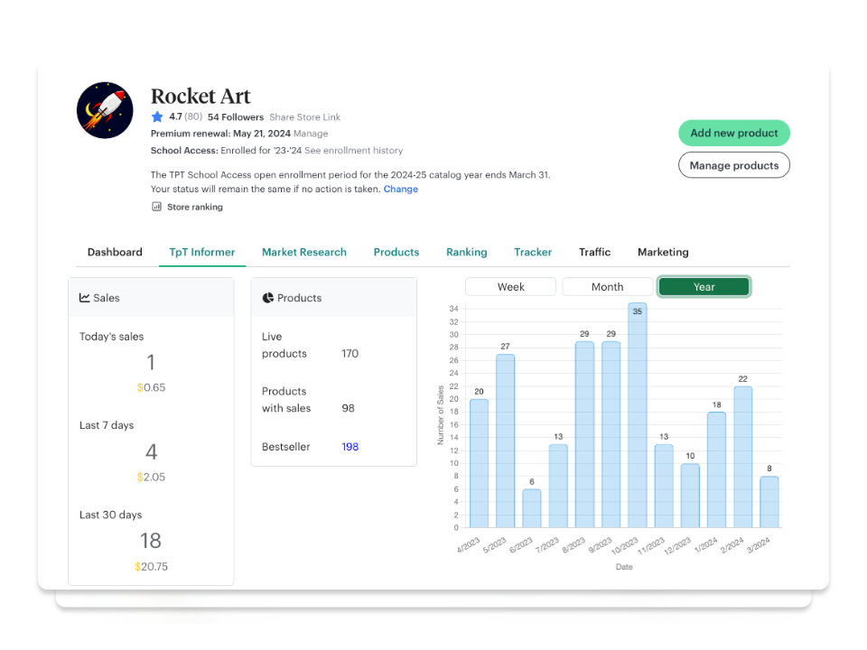
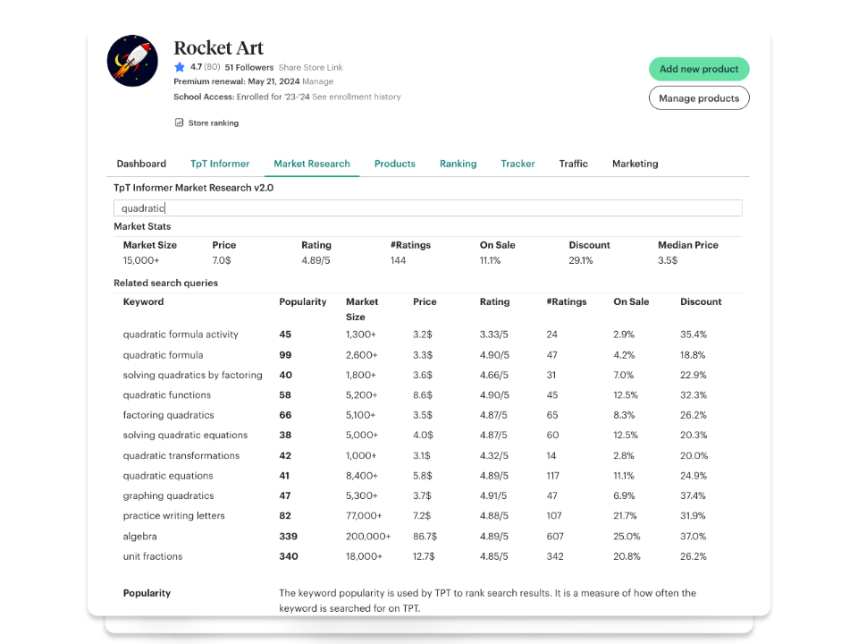
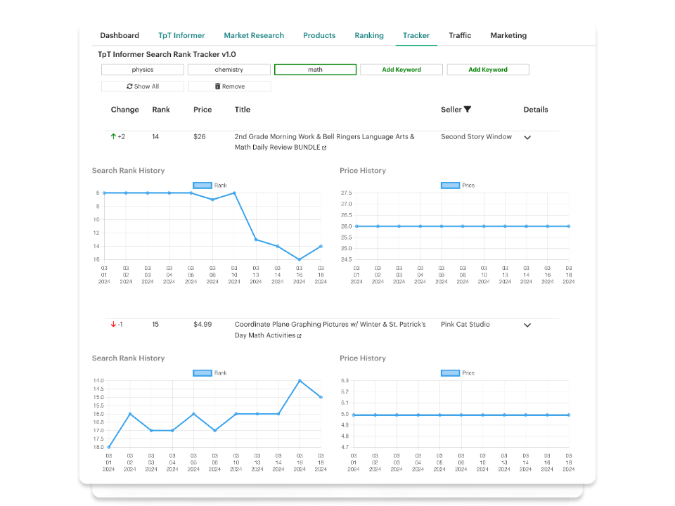
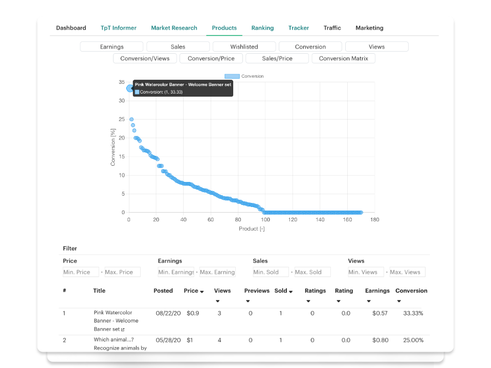

# TPT Informer Chrome Extension

Public repository of the TPT Informer Google Chrome Extension for sellers on Teachers Pay Teachers.

## Features

### New Dashboard

- 📈 Track your sales, views, and favorites in real-time
- 📊 See your top-performing products at a glance
- 📉 View your sales and views over time

### Advanced Analytics

- 👩🏻‍💻 Dive deep into the TpT market using our supercharged analytics tools!
- ✏️ Discover top-notch keywords for your products using our Market Research tool!
- 🔦 Track your competitors and see how they are doing

### Product Rank Tracker

- 👩🏻‍💻 Track the rank of the first 120 products for up to 5 different keywords
- 📊 Analyze your product's performance and make data-driven decisions
- 📈 Monitor your product's rank over time and identify trends

### Statistics dashboard

- 📊 Analyze your products on different metrics
- 📈 See your top-performing products at a glance
- ✅ Filter and sort your products by different metrics

## Usage

Please visit the Chrome Webstore to install the extension.

You can also clone this repository and load the unpacked extension manually.

